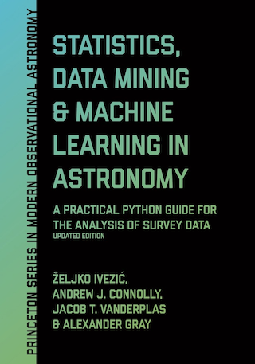

=======================================================
AstroML: Machine Learning and Data Mining for Astronomy
=======================================================
..
   Here we are building a banner: a javascript selects randomly 4 images in
   the list.  Code adapted from scikit-learn documentation

.. only:: html

    .. |banner1| image:: examples/images/datasets/plot_moving_objects_2.png
       :height: 150
       :target: examples/datasets/plot_moving_objects.html

    .. |banner2| image:: examples/images/datasets/plot_wmap_power_spectra_1.png
       :height: 150
       :target: examples/datasets/plot_wmap_power_spectra.html

    .. |banner3| image:: book_figures/images/chapter3/fig_uniform_mean_1.png
       :height: 150
       :target: book_figures/chapter3/fig_uniform_mean.html

    .. |banner4| image:: book_figures/images/chapter4/fig_lyndenbell_gals_1.png
       :height: 150
       :target: book_figures/chapter4/fig_lyndenbell_gals.html

    .. |banner5| image:: examples/images/datasets/plot_moving_objects_1.png
       :height: 150
       :target: examples/datasets/plot_moving_objects.html

    .. |banner6| image:: book_figures/images/chapter7/fig_PCA_LLE_2.png
       :height: 150
       :target: book_figures/chapter7/fig_PCA_LLE.html

    .. |banner7| image:: examples/images/datasets/plot_nasa_atlas_1.png
       :height: 150
       :target: examples/datasets/plot_nasa_atlas.html

    .. |banner8| image:: examples/images/datasets/plot_sdss_line_ratios_1.png
       :height: 150
       :target: examples/datasets/plot_sdss_line_ratios.html

    .. |banner9| image:: book_figures/images/chapter10/fig_LINEAR_clustering_1.png
       :height: 150
       :target: book_figures/chapter10/fig_LINEAR_clustering.html

    .. |banner10| image:: book_figures/images/appendix/fig_sdss_filters_1.png
       :height: 150
       :target: book_figures/appendix/fig_sdss_filters.html

    .. |center-div| raw:: html

        

    .. |end-div| raw:: html

        

        

    |center-div| |banner1| |banner2| |banner3| |banner4| |banner5| |banner6| |banner7| |banner8| |banner9| |banner10| |end-div|

.. only:: html

 .. sidebar:: Downloads

    * Released Versions: `Python Package Index <http://pypi.python.org/pypi/astroML/>`_

    * Bleeding-edge Source: `github <https://github.com/astroML/astroML>`_

.. sectionauthor:: Jake Vanderplas <vanderplas@astro.washington.edu>

AstroML is a Python module for machine learning and data mining built on
`numpy <http://numpy.scipy.org>`_,
`scipy <http://scipy.org>`_,
`scikit-learn <http://scikit-learn.org>`_,
`matplotlib <http://matplotlib.org>`_,
and `astropy <http://astropy.org>`_,
and distributed under the 3-clause BSD license.
It contains a growing library of statistical and machine learning
routines for analyzing astronomical data in Python, loaders for several open
astronomical datasets, and a large suite of examples of analyzing and
visualizing astronomical datasets.

The goal of astroML is to provide a community repository for fast Python
implementations of common tools and routines used for statistical
data analysis in astronomy and astrophysics, to provide a uniform and
easy-to-use interface to freely available astronomical datasets.
We hope this package will be useful to researchers and students of
astronomy.  If you have an example you'd like to share, we are happy to
accept a contribution via a GitHub
`Pull Request <https://help.github.com/articles/using-pull-requests>`_:
the code repository can be found at
`http://github.com/astroML/astroML <http://github.com/astroML/astroML>`_.

Textbook
=========

The astroML project was started in 2012 to accompany the book **Statistics,
Data Mining, and Machine Learning in Astronomy**, by Željko Ivezić, Andrew
Connolly, Jacob Vanderplas, and Alex Gray, published by `Princeton University Press
<https://press.princeton.edu/books/hardcover/9780691198309/statistics-data-mining-and-machine-learning-in-astronomy>`__. The
table of contents is available :download:`here(pdf) <documents/DMbookTOC.pdf>`,
or you can preview or purchase the book on
`Amazon <https://www.amazon.com/Statistics-Mining-Machine-Learning-Astronomy/dp/0691198306/>`__.

A second edition is published in December 2019. This updated edition features
new sections on deep learning methods, hierarchical Bayes modeling, and
approximate Bayesian computation. The chapters have been revised throughout
and the astroML code has been brought completely up to date.

Did you find a mistake or typo in the book? We maintain an up-to-date
`listing of errata <https://github.com/astroml/text_errata>`_
in the text which you can view on GitHub. If you find a mistake
which is not yet noted on that page, please let us know via email or GitHub
pull request!

.. include:: includes/big_toc_css.rst

User Guide
==========

.. toctree::
   :maxdepth: 2

   user_guide/index

Example Plot Galleries
======================

.. toctree::
   :maxdepth: 2

   examples/index
   book_figures/index
   paper_figures/index

Development
===========

.. toctree::
   :maxdepth: 2

   development/index

.. _citing-astroml:

Citing astroML
==============
If you make use of any of these datasets, tools, or examples in a scientific
publication, please consider citing astroML.  You may reference the following
paper:

- `Introduction to astroML: Machine learning for astrophysics
  <http://ieeexplore.ieee.org/xpl/articleDetails.jsp?tp=&arnumber=6382200>`_,
  Vanderplas *et al*, proc. of CIDU, pp. 47-54, 2012.

  **Recipient of the best paper award for CIDU 2012**

  Bibtex entry::

       @INPROCEEDINGS{astroML,
        author={{Vanderplas}, J.T. and {Connolly}, A.J.
                and {Ivezi{\'c}}, {\v Z}. and {Gray}, A.},
        booktitle={Conference on Intelligent Data Understanding (CIDU)},
        title={Introduction to astroML: Machine learning for astrophysics},
        month={oct.},
        pages={47 -54},
        doi={10.1109/CIDU.2012.6382200},
        year={2012}
       }

You may also reference the accompanying textbook:

- Statistics, Data Mining, and Machine Learning for Astronomy,
  Ivezic *et al*, 2014

  Bibtex entry::

       @BOOK{astroMLText,
        title={Statistics, Data Mining and Machine Learning in Astronomy},
        author={{Ivezi{\'c}}, {\v Z}. and {Connolly}, A.J.
                and {Vanderplas}, J.T. and {Gray}, A.},
        publisher={Princeton University Press},
        location={Princeton, NJ},
        year={2014}
       }
