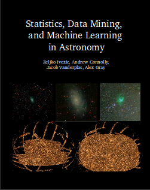

.. _introduction:

Introduction
============

.. _philosopy:

Philosophy
----------
astroML is a Python module built within the framework of Python's Scipy
ecosystem, designed as a repository for fast and well-tested code for
the analysis of astronomical data.  It is envisioned to be a community
resource, with the development and submission of new algorithms, data sets,
and examples provided by `GitHub's <http://github.com>`_ collaborative
coding interface.

astroML is designed to be a resource for both researchers and students of
astronomy and Python.  Rather than focusing on re-developing fast algorithms,
astroML makes use of the large collection of well-tested routines available
in `numpy <http://numpy.scipy.org>`_,
`scipy <http://scipy.org>`_,
`scikit-learn <http://scikit-learn.org>`_,
`matplotlib <http://matplotlib.org>`_,
`astropy <http://astropy.org>`_, and other packages.

astroML strives to bring the astronomical community closer to the ideals of
`Reproducible Research <http://reproducibleresearch.net/index.php/Main_Page>`_,
in which research papers are accompanied by well-written code to duplicate,
check, and extend the results.

.. _textbook:

Textbook
--------

.. figure:: ../_static/text_cover_2nd.png
     :width: 150 px
     :align: right
     :target: http://www.amazon.com/Statistics-Mining-Machine-Learning-Astronomy/dp/0691198306/

The astroML package is used to create all of the examples and figures in the
book **Statistics, Data Mining, and Machine Learning in Astronomy**,
by Željko Ivezić, Andrew Connolly, Jacob Vanderplas, and Alex Gray,
published by Princeton University Press
(`view on Amazon
<http://www.amazon.com/Statistics-Mining-Machine-Learning-Astronomy/dp/0691198306/>`_). A
second edition is published in December 2019. This updated edition features
new sections on deep learning methods, hierarchical Bayes modeling, and
approximate Bayesian computation. The chapters have been revised throughout
and the astroML code has been brought completely up to date.

These figures can be seen in the :ref:`book_fig_root` section, along with
the full Python scripts used to generate them.

The text contains detailed theoretical background of many of the
tools and methods available in astroML, and also many of the tools
available in `scikit-learn <http://scikit-learn.org>`_
which are used in the examples here. The on-line documentation at this site
is growing, but we recommend refering to the text for more details.
